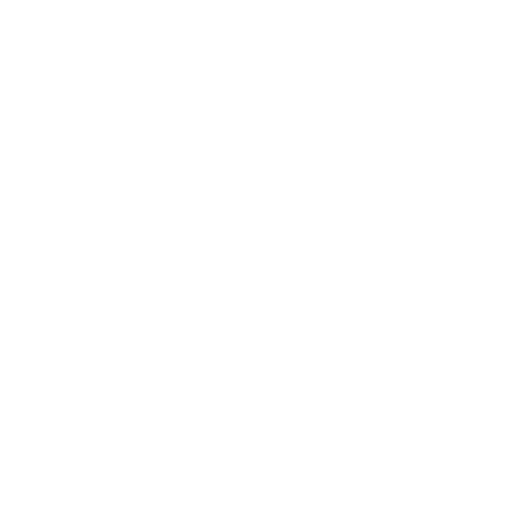

    <section id="project-detail">
        <a href="index.html#projects" class="back-link">← Retour aux projets</a>

        <h2>Projet Paaxio</h2>
        <h3 class="subtitle">Développement d'un site web selon un cahier des charges</h3>

        

            

            <h3>Description du projet</h3>
            

                Paaxio est un projet universitaire ambitieux qui se divise en deux phases.
                La première phase (première année) a consisté à rédiger un <strong>cahier des charges complet</strong> définissant
                les fonctionnalités et les spécifications du site. La deuxième phase (actuellement en cours en deuxième année)
                implique le <strong>développement du site web fonctionnel</strong> respectant ce cahier des charges.
            

            <h3>Concept du projet</h3>
            

                Paaxio est une plateforme innovante destinée à offrir une expérience utilisateur unique.
                Le projet combine design moderne et fonctionnalités avancées pour répondre aux besoins spécifiques définis dans le cahier des charges.
            

            <h3>Phase 1 - Cahier des charges (Année 1) ✓</h3>
            

                <ul>
                    <li>Analyse des besoins utilisateurs</li>
                    <li>Définition des fonctionnalités principales</li>
                    <li>Spécifications techniques détaillées</li>
                    <li>Création de wireframes et prototypes</li>
                    <li>Planification du projet</li>
                </ul>
            

            <h3>Phase 2 - Développement web (Année 2) </h3>
            

                Cette phase consiste à implémenter le cahier des charges précédemment défini.
                Le site sera développé en respectant scrupuleusement les spécifications et en
                utilisant les meilleures pratiques de développement web.
            

            <h3>Objectifs de développement</h3>
            <ul class="objectives-list">
                <li>Créer une interface utilisateur attrayante et intuitive</li>
                <li>Implémenter les fonctionnalités selon les spécifications</li>
                <li>Gérer les données de manière sécurisée</li>
                <li>Assurer une expérience utilisateur optimale</li>
                <li>Respecter les standards web et d'accessibilité</li>
                <li>Assurer la performance et la scalabilité</li>
            </ul>

            <h3>Technologies utilisées</h3>
            

                <i class="devicon-html5-plain colored"></i> HTML5
                <i class="devicon-css3-plain colored"></i> CSS3
                <i class="devicon-javascript-plain colored"></i> JavaScript
                <i class="devicon-php-plain colored"></i> PHP
                <i class="devicon-mysql-plain colored"></i> MySQL
            

            <h3>Points forts attendus</h3>
            <ul class="strengths-list">
                <li>Respect strict du cahier des charges</li>
                <li>Interface utilisateur professionnelle</li>
                <li>Code modulaire et maintenable</li>
                <li>Documentation complète</li>
            </ul>

            <h3>Apprentissages attendus</h3>
            <ul class="learnings-list">
                <li>Gestion complète du cycle de développement d'un projet</li>
                <li>Implémentation d'un cahier des charges en environnement professionnel</li>
                <li>Travail en équipe et collaboration</li>
                <li>Gestion de projet et planification</li>
                <li>Développement full-stack</li>
            </ul>

            <h3>État du projet</h3>
            

                <strong>Phase 1 : </strong> Cahier des charges complété et validé 
                <strong>Phase 2 : </strong> En cours de développement
            

            

                <a href="https://github.com/Justasync/SAEPaaxio" class="btn-github">Voir sur GitHub</a>
            

        

    </section>
